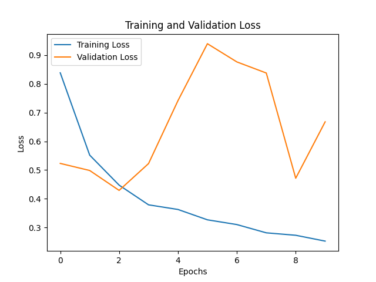

# LSTM Sentiment Analysis Project

## Overview

This project focuses on building Long Short-Term Memory (LSTM) models to perform sentiment analysis on IMDB movie reviews. Specifically, it aims to classify reviews as either positive or negative. Three models of varying parameter sizes were developed and evaluated, ranging from approximately 15 million to 148 million parameters. The results demonstrate how increasing model capacity can enhance the model's understanding of more nuanced sentiments.

- **GitHub Repository**: [LSTM Sentiment Analysis](https://github.com/Mac-Huang/LSTM.git)

## Project Objectives

- To investigate how varying model complexity affects the sentiment analysis performance.
- To explore the behavior of LSTM models in handling nuanced and tricky reviews.
- To evaluate model performance in terms of accuracy and generalization, focusing on tricky cases.

## Models Summary

The project includes three LSTM models with different parameter counts:

1. **15 Million Parameters**
2. **45 Million Parameters**
3. **148 Million Parameters**

The parameter sizes were adjusted by changing the embedding dimension, hidden layer size, and number of layers, which resulted in a gradual increase in the model's capacity.

| Model | Embedding Dimension | Hidden Dimension | Number of Parameters |
|-------|---------------------|------------------|----------------------|
| LSTM_15m | 256 | 256 | ~15 Million |
| LSTM_45m | 512 | 512 | ~45 Million |
| LSTM_148m | 1024 | 1024 | ~148 Million |

## Results

The results show that increasing the model size provided incremental improvements in overall performance metrics, particularly for nuanced and difficult reviews.

### Model Metrics

| Model | Train Loss | Train Accuracy | Validation Loss | Validation Accuracy | Test Loss | Test Accuracy |
|-------|------------|----------------|-----------------|----------------------|-----------|---------------|
| LSTM_15m  | 0.298 | 86.86% | 0.458 | 86.46% | 0.485 | 86.25% |
| LSTM_45m  | 0.246 | 89.64% | 0.543 | 86.67% | 0.557 | 86.69% |
| LSTM_148m | 0.253 | 89.29% | 0.668 | 86.01% | 0.697 | 86.06% |

### Tricky Reviews Performance
Despite only modest improvements in general accuracy, the larger model (148M parameters) showed a clear advantage in handling more nuanced reviews. For example:

- **Review: "I didn't hate it, but I wouldn't watch it again."**
  - Prediction: **Positive** (15M, 45M) → **Negative** (148M)

- **Review: "I laughed a few times, but the rest of the film was just awkward and badly paced."**
  - Prediction: **Positive** (15M, 45M) → **Negative** (148M)

The larger model demonstrated an enhanced ability to identify subtle negative sentiments hidden within mixed reviews, highlighting the value of increased model capacity in capturing complex contexts.

## Training Analysis

The training and validation loss progression can be seen in the plot saved at `./outputs/loss_epoch_plot.png`. The plot shows a steady decline in training loss, indicating that the models are learning effectively during training.

However, the validation loss exhibited instability across epochs, which could be attributed to several factors:

1. **Overfitting**: The larger models may have overfitted to the training data due to their increased capacity, leading to fluctuations in validation performance.
2. **Model Complexity**: The high number of parameters makes the model more powerful but also harder to generalize well, especially given a limited dataset size.
3. **Data Imbalance or Complexity**: Nuanced reviews that mix positive and negative elements can lead to inconsistent validation loss as the model struggles to learn clear distinctions.

## Improvements to Consider

### 1. Regularization
Implementing stronger regularization techniques like **L2 weight decay** or increasing the **dropout rate** could help reduce overfitting and stabilize validation loss.

### 2. More Training Data
Acquiring more labeled training data or augmenting the existing dataset could improve generalization, especially for nuanced reviews.

### 3. Hyperparameter Tuning
Further tuning of hyperparameters, such as the learning rate, batch size, or dropout rate, may help achieve a better balance between training and validation performance.

### 4. Advanced Architectures
Exploring transformer-based architectures or hybrid LSTM-transformer models could potentially yield better performance, particularly for understanding complex reviews.

### 5. Early Stopping
Implementing **early stopping** during training could prevent overfitting by stopping the training process when the validation loss starts to increase consistently.

## Conclusion
This project highlights the trade-offs between model size and generalization performance. While larger models provide greater capacity to understand complex sentiments, they also risk overfitting and may struggle with validation consistency. The findings suggest that careful balancing of model complexity, regularization, and data is crucial to achieving reliable performance in sentiment analysis.

Feel free to check out the full code and detailed implementation in the GitHub repository: [LSTM Sentiment Analysis](https://github.com/Mac-Huang/LSTM.git)

Contributions and suggestions for improvements are welcome!

